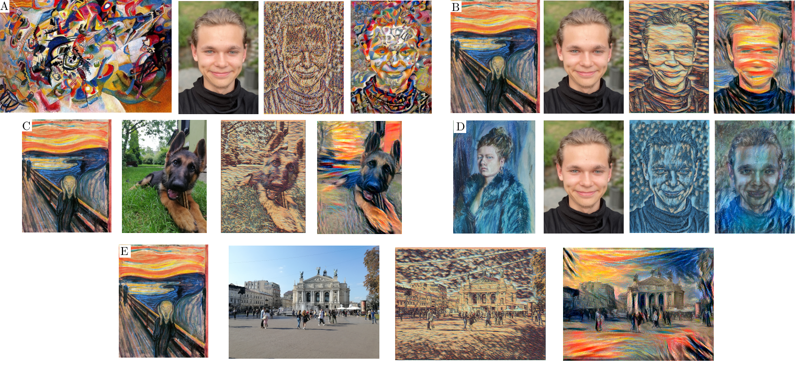

# Neural Style Transfer desktop application
## Based on my engineer's thesis: *Review of machine learning algorithms for image processing*.
---
# About thesis

**Abstract:** Presented Engineer's Thesis analyzes one of the machine learning image processing methods, called Neural Style Transfer (NST). Both the mathematical basis and practical implementation of the system are presented.

In the beginning, the most important definitions in the field of machine and deep learning are presented. Then, as a follow-up, the NST architecture is analyzed, based on the article \cite{Gatys}. The mathematical interpretation of the most crucial components is explained, which are used in mentioned implementation.

The main motivation for created system was its versatility, which allows to analyze the influence of all parameters, including those not previously studied. It consists of two modules - convolutional neural network training and mentioned NST network, described in next sections.
Finally, the most important results are presented, which allow making an observation and eventually answering a number of author's theses. 

# About application

Create env: `conda env create -f environment.yml`

`python NST.py -h`

`python NST.py -h [src_image] [style_image] -t`

Only TUI is available!

Tested on Ubuntu 20.04 and 22.04 

**Requirements**:
 - python3 (tested 3.8.5)
 - anaconda (tested 4.9.2)
 - CUDA for GPU (https://developer.nvidia.com/cuda-zone)
 - environment.yml
 
___

# O pracy

**Streszczenie** W pracy przeanalizowano jeden ze sposobów przetwarzania obrazów za pomocą uczenia maszynowego, zdefiniowany jako transfer stylu. Przedstawiono zarówno matematyczną podstawę jego działania jak i praktyczną implementację systemu w pełni go realizującego. 

W ramach wstępu zaprezentowano najważniejsze zagadnienia z dziedziny uczenia głębokiego i maszynowego. Następnie dokonano analizy struktury sieci wykonującej transfer stylu, bazującej na artykule \cite{Gatys}. Wytłumaczono matematyczną interpretację najważniejszych komponentów, która posłużyła jako baza do stworzenia autorskiej implementacji.

Główną motywacją do stworzenia własnego systemu, była chęć przeanalizowania wpływu parametrów, również tych wcześniej dokładnie niezbadanych, na otrzymywane wyniki. Z tym założeniem zaproponowano dwa moduły, który miałyby taką obserwację umożliwić. Należą do nich moduł odpowiadający za trening sieci konwolucyjnej, jak i również moduł realizujący transfer stylu, które opisano w kolejnej części pracy.

Na zakończenie zaprezentowano najważniejsze rezultaty, na podstawie których poczyniono obserwacje, umożliwiające udzielenie odpowiedzi na szereg postawionych tez. 

# O aplikacji

Tworzenie środowiska: `conda env create -f environment.yml`

`python NST.py -h`

`python NST.py -h [src_image] [style_image] -t`

Obecnie dostępna tylko wersja TUI.

**Wymagania**:
 - python3 (tested 3.8.5)
 - anaconda (tested 4.9.2)
 - CUDA for GPU (https://developer.nvidia.com/cuda-zone)
 - environment.yml

---
**If you want to use my code in your thesis/work, please leave any sign :)**
___

Example results:

*Google Magenta results compared to my implementation. Results are splited into a few groups, from the left: style image, content image, Google Magenta's result and my implementation's results.*

___

All Rights Reserved
Copyright (c) by Oliwier Kaszyca 2022
